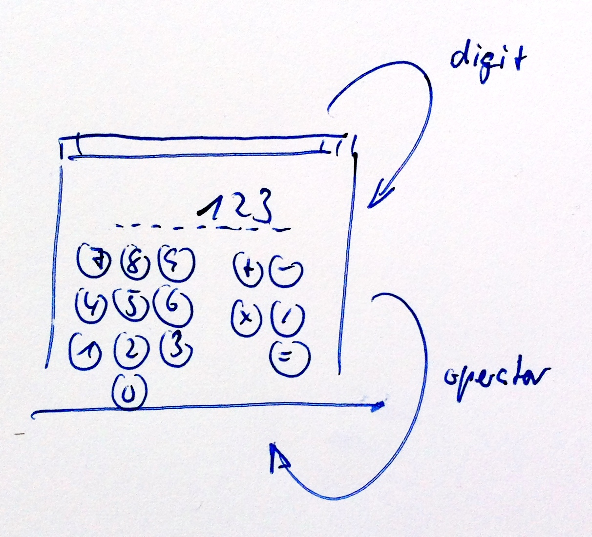
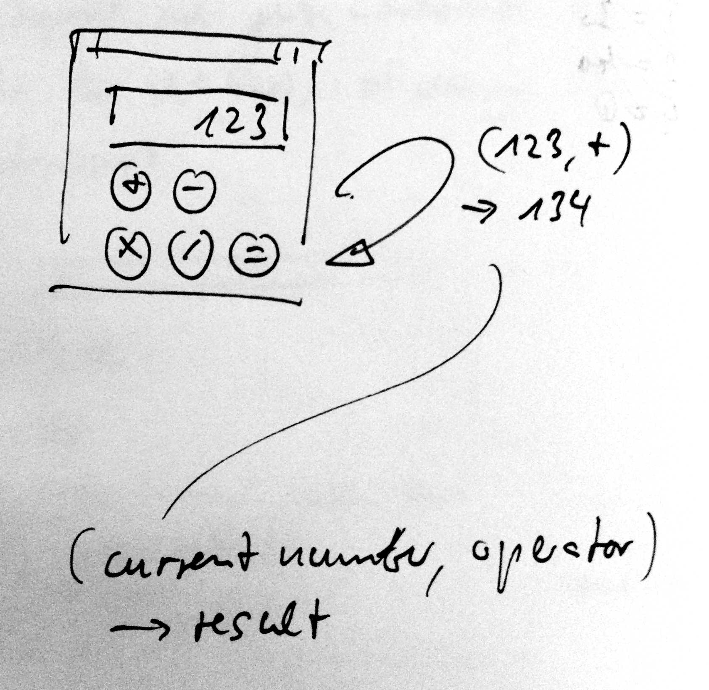
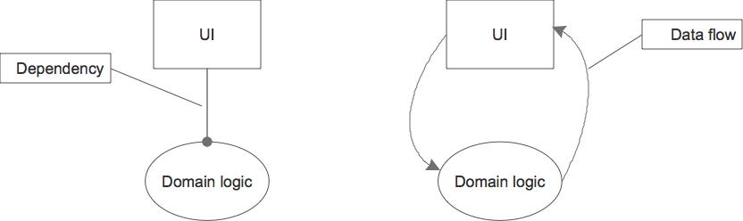
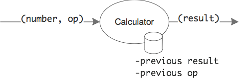

# Desktop Calculator - Iteration 2
Change the Desktop Calculator from iteration 1 so that the number is entered not by typing into a textbox, but by pressing a key for each digit.

Of course selecting a digit key does not need to be done with a mouse; pressing the respective keyboard key should work too.

Other than that the application should stay the same.

## Design

# Desktop Calculator - Iteration 1
Implement a simple desktop calculator with the following user interface:

It´s somewhat similar to the Windows desktop calculator in that it does not know operator precedences. But the number can be entered in its own text box. (No digit buttons in on the dialog.)

Once an operator is pressed the next result is calculated. Here´s an example of a multi step calculation and its results:

1. 2, + -> 2
1. 3, * -> 5
1. 4, = -> 20

The next result is calculated with the current number displayed and an operator -> and results in a new number to be displayed.

For each operator a button has to be provided. Their functionality should not require further explanations ;-)

Division by 0 causes a message to be displayed - either as a message box or in some status bar.

When the program starts and after each operator the cursor is in the result textbox with all its content selected. That way entering the next number is easy.

Also the operators should be accessible through their respective keys; no need to click the buttons.

Initially the result textbox is set to 0.

## Design
Clearly there are two concerns on the table:

* user interface
* calculation domain

Each should be represented by its own functional units (i.e. class).

There seem to be two ways of connecting them: by making one depending on the other, e.g. the UI _uses_ a domain object as a service, or by keeping them independent, i.e. neither knows of the other.

Since dependencies make code harder to change and test, the latter approach seems prudent. However the first approach is more common. To keep the exercise simple it seems prudent to take the more common road.

That means, only one explicit interface is needed:

	interface ICalculator {
		int Calculate(int number, string operator);
	}
	
Whenever an operator is triggert by the user (mouse click, shortcut key), the UI bundles up the current number from the text box with the operator and passes it to _Calculate()_ to receive a result.

The input to calculation is (number, operator), the output is a single number - which cannot be derived from just the input. So there needs to be some state with which to combine the input.

In fact calculating the result means to apply the _previous_ operator to the _previous result_ and the number from the input. The result as well as the _current_ operator then will become the state of the calculator for the next request.

	new result = previous op(previous result, current number)
	previous result = new result
	previous op = op

## Test Cases

#### Domain logic

* Happy day: Nth op builds on previous data
* First op results in current number
* Check ops
* Equal resets previous data
* Division by zero throws an exception
* Division by zero does not alter calculator state

#### UI

* Happy day use of domain logic
* Exception from domain logic is caught and displayed appropriately

* Ops accessible by shortcut key
* Cursor back in textbox with number selected upon result delivery

#### Acceptance tests

* (2, +) = 2
* (3, *) = 5
* (4, =) = 20
* (20, +) = 20
* (7, =) = 27

* (8, /) = 8
* (0, =) = Error message
* (2, =) = 4
