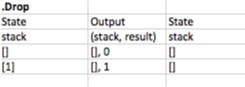

# RPN Desktop Calculator
Idea taken from [Brett Schuchert´s video series](http://vimeo.com/album/205252)

A RPN calculator works on math formulas in postfix notation rather than infix:

* Infix: 2 + 3 * 4 is either 20 (no op precedence) or 14 (with op precedence)
* Postfix: 2 3 + 4 * is 20 or 2 3 4 + * is 14 or 2 3 4 * + is 14

The UI should roughly look like this:

The current number on the last line (4) (entry field) is put on a stack (numbers 2 and 3) upon pressing ENTER.

Or the current number (4) is combined with the stack top (3) upon pressing an operator leading to a new current number.

Or the stack is reduced by pressing DROP which means the stack top is removed and replaces the current number.

The calculator only needs to support integer numbers, the basic operators {+, -, *, /}, the advanced operator !, ENTER and DROP.

To quickly gain feedback, development should move forward in small increments:

1. ENTER numbers, show stack
1. +
1. DROP
1. -, *, /
1. !

## Design
### Domain Analysis
The solution consists of 1 application with 1 dialog.

The dialog consists of 2 + n interactions:

1. ENTER: Push current number on stack
2. DROP: Pop number from stack and make it the current number
3. Operator: Combine current number with stack and make the result the current number

#### UI
The UI grows increment by increment like this:

### Architecture
The solution consists of 1 process.

Winforms is used for the GUI portal.

#### Model
It seems natural to model the calculation logic as an actor instead of an action. It´s clearly stateful and can be thought of to represent a hardware device:

The actions .Push and .Drop are trivial. They only modify the internal stack. But how does calculation work?

The operator pressed is passed into the calculator as a string. That string is used to look up the actual operation. Operations are kept in a list and are of the form Func<Stack,int>: they pop as many operands as needed from the stack and return a result.

By keeping the operations in a list they can easily be extended.

"Execute operation" is special in that the functional unit in the flow states it´s working on an input (here: operation). That makes implementation easier.

## Tests

