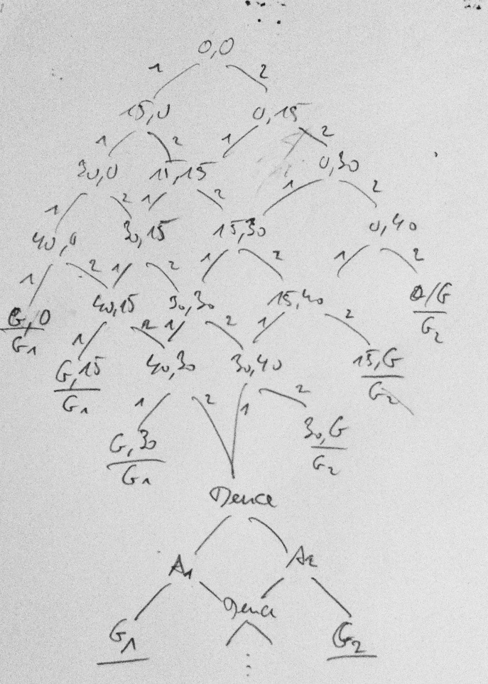

# Tennis
Implement a referee class to keep score of a tennis game. This exercise was inspired by [KataTennis](http://codingdojo.org/cgi-bin/wiki.pl?KataTennis) from the Coding Dojo Wiki.

The API should look like this:

	class TennisReferee {
		TennisReferee(string player1Name, string player2Name) {...}
		
		string RegisterWinFor(Players player) {...}
		string CurrentScore { get {...} }
		string Winner { get {...} }
	}

	enum Players {
		Player1,
		Player2
	}

The current score should be returned like this from _RegisterWinFor()_ as well as the _CurrentScrore_ property:

	"15:40"
	"Deuce"
	"Advantage Nadal"
	"Advantage Federer"

As the winner the name of a player is returned - or the empty string as long as there is no winner.

Usage sample:

	var r = new TennisReferee("Federer", "Nadal");
	r.RegisterWinFor(Players.Player1);
	r.RegisterWinFor(Players.Player1);
	r.RegisterWinFor(Players.Player2);
	Console.WriteLine(r.CurrentScore); // "30:15"
	...
	Console.WriteLine(r.Winner); // "Federer"

Like described in the Kata only one game needs to be scored. The points to gain are:

	love // no win yet
	15
	30
	40
	deuce
	advantage
	game over

Once both players gained 40 the score is deuce. Then the same player needs to win twice in a row to win the game.

## Design
The difficult part about the referee class is counting the score. There are two phases to it:

1. Counting until (or without) deuce
2. Counting after deuce

This is clearly illustrated by the following finite state diagram:

The scores are the states and the numbers next to the lines are the events triggering a transition.

As is evident, the diagram structure changes markedly below the Deuce state, hence the two phases for scoring.

## Test Cases
#### RegisterWin
* First win
* Second win same player
* Players winning alternately
* Winning a game without deuce

* Entering deuce state
* Advantage
* Winning game from advantage
* Losing advantage

* Registering wins after game has been won does not change score

#### CurrentScore
* No wins registered
* Score after some wins

#### Winner
* Game still on
* Game has been won

#### Acceptance tests

* Players: "A", "B"
* Players winning in this order: B,B,A
* Current Score = "15:30"
* Players winning in this order: A,A,A
* CurrentScore = "Game over"
* Winner = "A"

* Players: "A", "B"
* Players winning in this order: A,B,A,A,B,B
* CurrentScore = "Deuce"
* Players winning in this order: A,B,B
* CurrentScore = "Advantage B"
* Players winning in this order: B
* CurrentScore = "Game over"
* Winner = "B"

