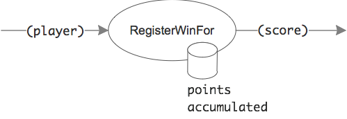
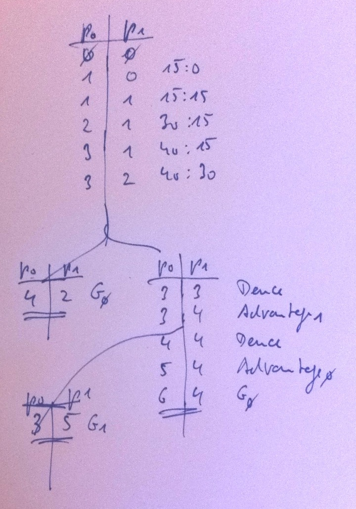

# Tennis
Implement a referee class to keep score of a tennis game. This exercise was inspired by [KataTennis](http://codingdojo.org/cgi-bin/wiki.pl?KataTennis) from the Coding Dojo Wiki.

The API should look like this:

	class TennisReferee {
		TennisReferee(string player1Name, string player2Name) {...}
		
		string RegisterWinFor(Players player) {...}
		string CurrentScore { get {...} }
		string Winner { get {...} }
	}

	enum Players {
		Player1,
		Player2
	}

The current score should be returned like this from _RegisterWinFor()_ as well as the _CurrentScrore_ property:

	"15:40"
	"Deuce"
	"Advantage Nadal"
	"Advantage Federer"

As the winner the name of a player is returned - or the empty string as long as there is no winner.

Usage sample:

	var r = new TennisReferee("Federer", "Nadal");
	r.RegisterWinFor(Players.Player1);
	r.RegisterWinFor(Players.Player1);
	r.RegisterWinFor(Players.Player2);
	Console.WriteLine(r.CurrentScore); // "30:15"
	...
	Console.WriteLine(r.Winner); // "Federer"

Like described in the Kata only one game needs to be scored. The points to gain are:

	love // no win yet
	15
	30
	40
	deuce
	advantage
	game over

Once both players gained 40 the score is deuce. Then the same player needs to win twice in a row to win the game.

## Design
How does scoring work? The input is a player who just won a ball - and the output is a score like "40:15". What happens in between, what´s the transformation?

There needs to be some kind of accumulation of wins. That´s the state _RegisterWinFor()_ needs to update:

So tennis scoring seems to consists of two operations:

* __counting__: pure accumulation of wins or counting points; that´s what happens with the input. Otherwise the score cannot be "calculated"; it needs more data than just the current winner of a ball.
* __score keeping__: transforming these points into a score (e.g. deuce or game over); that´s what happens with the accumulation to produce the output.

Counting should be simple: a counter for each player holds the number of wins. Scoring then interprets these counts and their combination.

Here´s a table of counts and their scores:

* p0, p1: Players
* G0, G1: Game over, player _i_ wins

Scores are the result of the following "calculations":

* Game over: |p0-p1| >= 2 && Max(p0,p1) > 3
* Advantage: |p0-p1| == 1 && Max(p0,p1) > 3
* Deuce: p0 == p1 && p0 < 3

Which player has won or has the advantage is determined by whose count is higher. He´s called the __leader__.

## Test Cases
#### RegisterWin
* p0 wins ball
* p1 wins ball

* Initial score
* Game over without Deuce
* Game enters Deuce
* Advantage is gained
* Advantage is lost - back to Deuce
* Game over after advantage

* Registering wins after game has been won does not change score

#### CurrentScore
* Property reflects result of last _RegisterWinFor()_ call

#### Winner
* Game still on
* Game has been won

#### Acceptance tests

* Players: "A", "B"
* Players winning in this order: B,B,A
* Current Score = "15:30"
* Players winning in this order: A,A,A
* CurrentScore = "Game over"
* Winner = "A"

* Players: "A", "B"
* Players winning in this order: A,B,A,A,B,B
* CurrentScore = "Deuce"
* Players winning in this order: A,B,B
* CurrentScore = "Advantage B"
* Players winning in this order: B
* CurrentScore = "Game over"
* Winner = "B"

